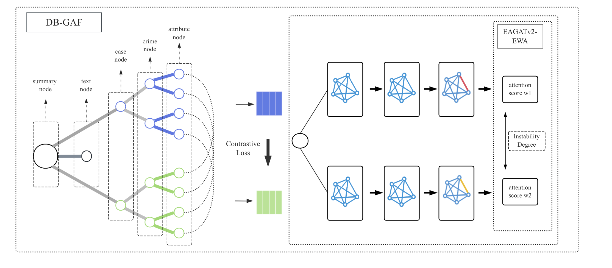

# DB-GAF: Enhancing Legal Case Retrieval with Dual-Branch Graph Contrastive Learning and Attribute Filtering
This repository provides the implementation of **DB-GAF**, a novel graph-based dual-branch framework for legal case retrieval with attribute filtering. The model leverages a graph-based approach to retrieve legal cases by considering both the graph structure of the data and the attribute filtering to improve retrieval accuracy.

## Framework
The framework composed of 4 modules for the whole paper.

## Model Architecture
The graph construction method for DB-GAF and attribute filtering.

## DataSets

The datasets are derived from the text data of:

Deng C, Mao K, Dou Z. (2024), "Learning Interpretable Legal Case Retrieval via Knowledge-Guided Case Reformulation", Proceedings of the 2024 Conference on Empirical Methods in Natural Language Processing, pp. 1253-1265.

The dataset includes the following directories:

- lecard
- lecardv2
- coliee2025
- processed_text

lecard and lecardv2 contain case attribute information extracted using large models based on the data provided by Deng et al. The processed_text directory contains the original text data from Deng's work.

## Usage

For module III and dual-branch graph contrastive learning:

python dual_branch_contrast_graph.py --exp_name db_contrast_graph --dataset lecardv2

For mudule IV and basic graph models:

python basic_graph_models.py --exp_name basic_graph_eagatv2_efwf --model EAGATv2 --dataset lecardv2 --drop_mode False

drop mode:

python basic_graph_models.py --exp_name basic_graph_eagatv2_efwf_drop --model EAGATv2 --dataset lecardv2 --drop_mode True --drop_type most --attribute_file ./split_files/v2_2_u.json

We also provide files for evaluation and visualization of the DB-GAF method.
- metric.py is used for evaluation.
- ./process/view_changement.py is used for visualizing instability and the variation trend of MAP values.

We have provided the results of our experiments in the ./experiment folder, along with two checkpoints in the ./checkpoints folder for reproduction.

## Note
The experimental results in this paper for the language model part are based on the SAILER pre-trained model, as described in Li H, Ai Q, Chen J, et al. (2023), "SAILER: Structure-Aware Pre-trained Language Model for Legal Case Retrieval", Proceedings of the 46th International ACM SIGIR Conference on Research and Development in Information Retrieval, pp. 1035-1044. Please download the pre-trained weights and modify the corresponding paths in the code before use.

